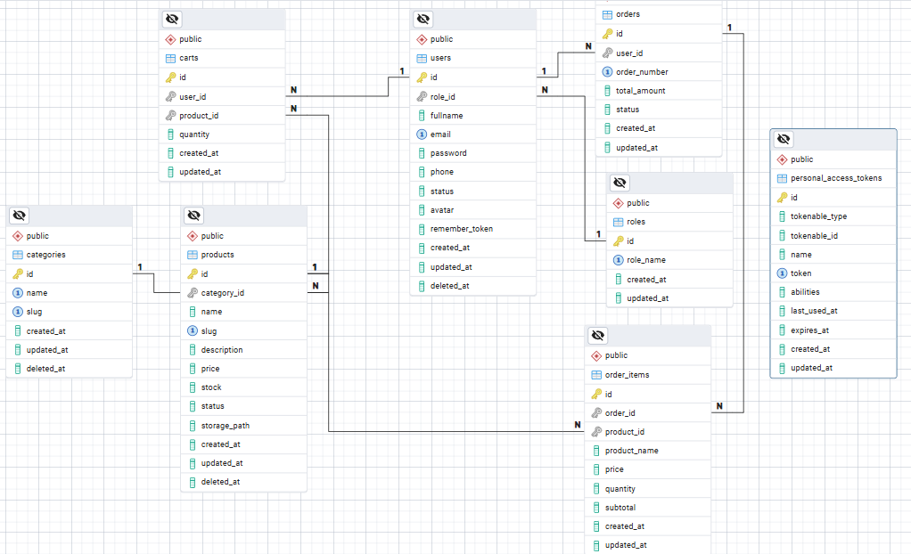
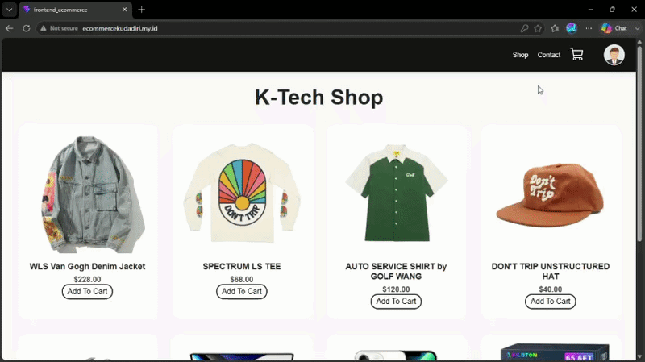
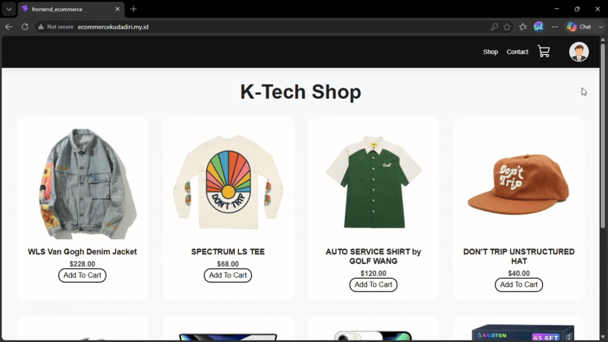
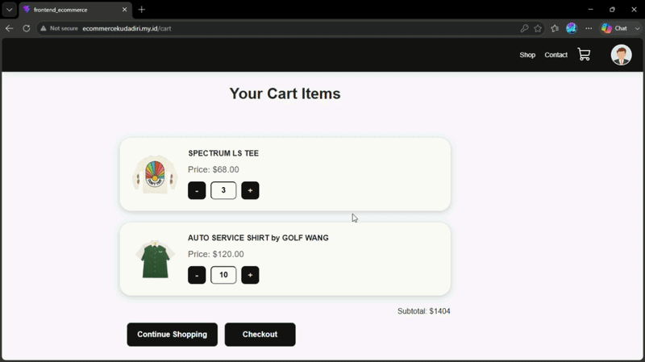
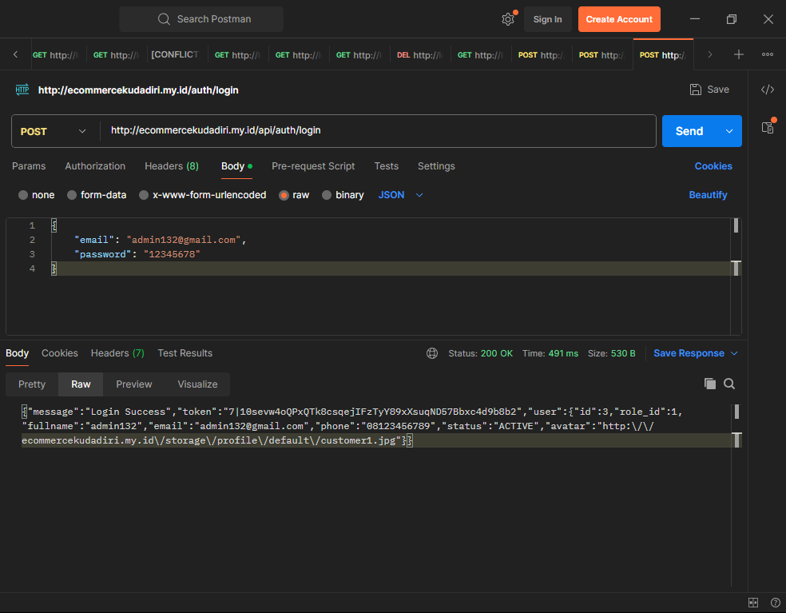
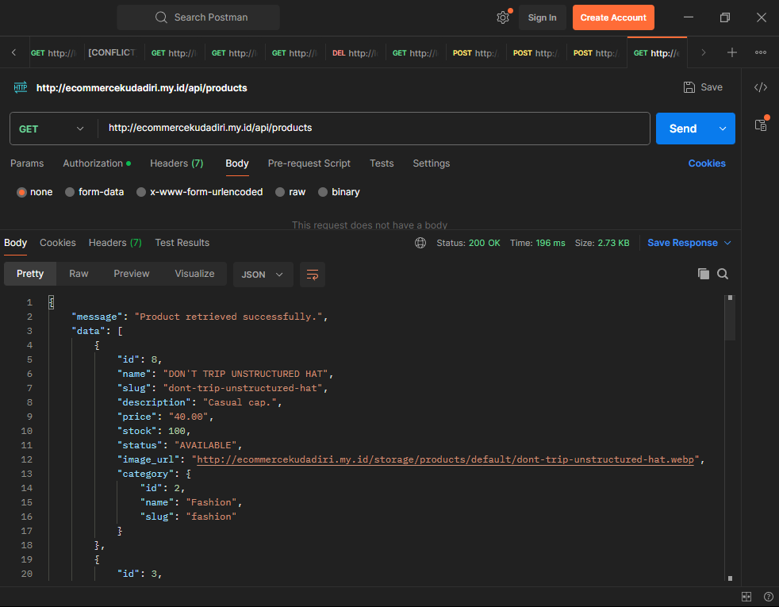
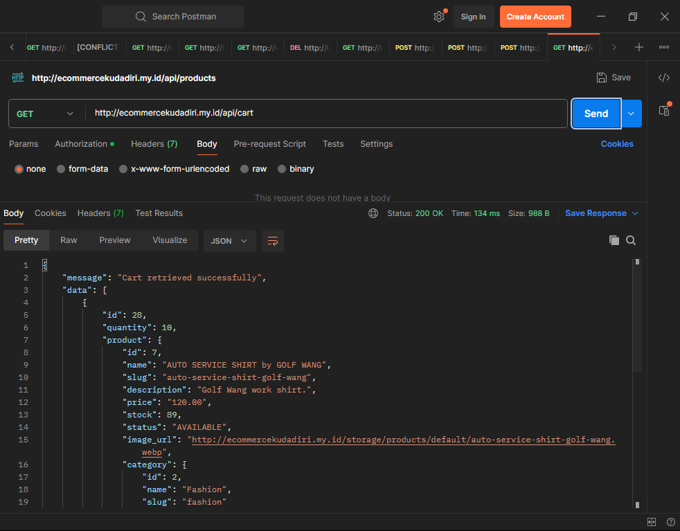
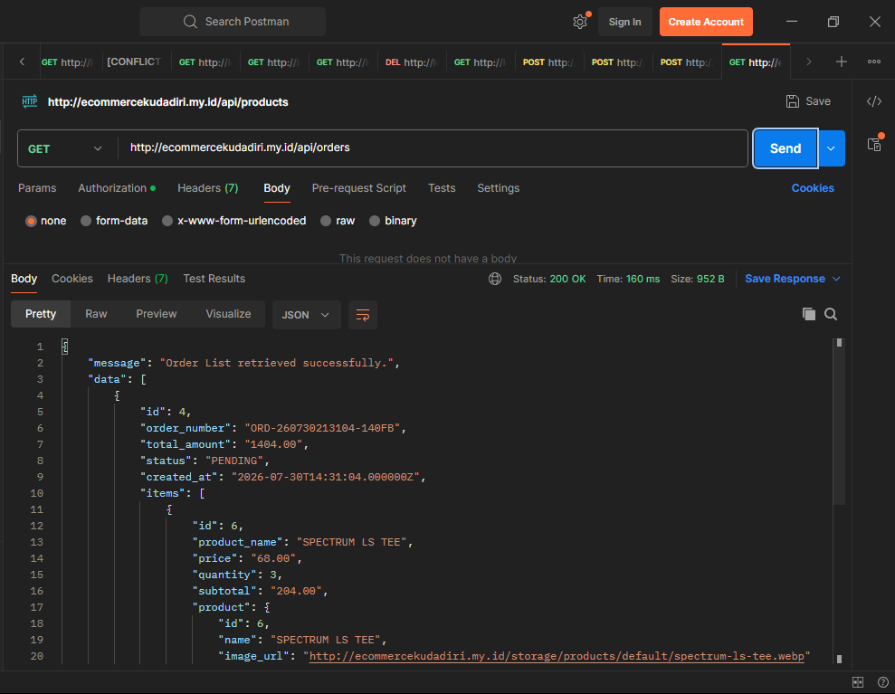

# K-Shop E-Commerce

K-Shop E-Commerce merupakan aplikasi **e-commerce full-stack** yang dibangun menggunakan **Laravel** sebagai *backend REST API* dan **React** sebagai *frontend*. Proyek ini dirancang untuk mengimplementasikan arsitektur *client-server* modern dengan memisahkan proses pengolahan data pada sisi backend dan penyajian antarmuka pengguna pada sisi frontend.

Proyek ini dikembangkan sebagai sarana pembelajaran sekaligus portofolio untuk mendemonstrasikan penerapan pengembangan aplikasi web full-stack, perancangan REST API, integrasi basis data, pengelolaan media menggunakan Laravel Storage, serta proses *deployment* aplikasi pada Ubuntu VPS menggunakan Nginx.

## Daftar Isi

* [Gambaran Proyek](#gambaran-proyek)
* [Teknologi dan Dependency Proyek](#teknologi-dan-dependency-proyek)
* [Arsitektur Proyek](#arsitektur-proyek)
* [Struktur Proyek](#struktur-proyek)
* [Struktur Skema Database](#struktur-skema-database)
* [Instalasi Proyek](#instalasi-proyek)
* [Alur Deployment](#alur-deployment)
* [Hasil dan Demo Program](#hasil-dan-demo-program)

    * [Front-End](#front-end)
    * [Back-End](#back-end)
* [Pengembangan di Masa Depan](#pengembangan-di-masa-depan)
* [Acknowledgements](#acknowledgements)
* [Author](#author)
* [License](#license)

## Gambaran Proyek

K-Shop E-Commerce merupakan aplikasi e-commerce berbasis web yang menerapkan arsitektur *client-server* dengan memisahkan *frontend* dan *backend* melalui komunikasi *REST API*. Aplikasi ini dibangun menggunakan **React JS** pada sisi frontend dan **Laravel** pada sisi backend, sehingga setiap proses bisnis, autentikasi, dan pengelolaan data dilakukan secara terpisah namun tetap terintegrasi.

Proyek ini dikembangkan untuk mensimulasikan alur dasar sebuah platform e-commerce modern, mulai dari autentikasi pengguna, penelusuran katalog produk, pengelolaan keranjang belanja, hingga proses pemesanan (*checkout*) dan riwayat pesanan. Selain itu, proyek ini juga mengimplementasikan penyimpanan gambar menggunakan Laravel Storage, pengelolaan token autentikasi menggunakan Laravel Sanctum, serta antarmuka yang responsif sehingga dapat digunakan pada berbagai ukuran perangkat.

### Highlight Proyek

* Menerapkan arsitektur *full-stack* dengan pemisahan *frontend* dan *backend*.
* Menggunakan *REST API* sebagai media komunikasi antar aplikasi.
* Sistem autentikasi pengguna menggunakan (*Laravel Sanctum*).
* Menampilkan katalog produk lengkap dengan gambar yang disimpan pada Laravel Storage.
* Fitur keranjang belanja (*shopping cart*) dengan pengelolaan jumlah produk.
* Proses *checkout* dan pencatatan riwayat pesanan (*order history*).
* Aplikasi telah berhasil di-*deploy* pada Ubuntu VPS menggunakan Nginx sebagai *reverse proxy* dan web server.

## Teknologi dan Dependency Proyek

Proyek ini dikembangkan menggunakan beberapa teknologi utama yang mendukung pengembangan aplikasi, mulai dari antarmuka pengguna, layanan backend, basis data, hingga proses deployment. Tabel berikut menjelaskan teknologi beserta peran masing-masing pada sistem.

| Kategori        | Teknologi                    |   Versi   | Peran                                                                  |
| --------------- | ---------------------------- |:---------:| ---------------------------------------------------------------------- |
| Frontend        | React                        |  19.2.7   | Membangun antarmuka pengguna berbasis *Single Page Application (SPA)*. |
| Build Tool      | Vite                         |   8.1.1   | Proses *development*, *bundling*, dan *build* aplikasi React.          |
| HTTP Client     | Axios                        |  1.18.1   | Melakukan komunikasi dengan Backend melalui REST API.                  |
| Routing         | React Router                 |  7.18.1   | Mengatur navigasi antar halaman pada aplikasi frontend.                |
| Notification    | React Hot Toast              |    2.6    | Menampilkan notifikasi interaktif kepada pengguna.                     |
| Icons           | Phosphor React & React Icons |     -     | Menyediakan ikon antarmuka pengguna.                                   |
| Backend         | Laravel                      |   12.64   | Menyediakan REST API, autentikasi, dan logika bisnis aplikasi.         |
| Authentication  | Laravel Sanctum              |    4.0    | Mengelola autentikasi berbasis token.                                  |
| Database        | PostgreSQL                   |   16.64   | Menyimpan seluruh data aplikasi.                                       |
| Web Server      | Nginx                        |   1.24    | Menyajikan frontend React serta meneruskan request API ke Laravel.     |
| PHP Runtime     | PHP-FPM                      |    8.3    | Menjalankan aplikasi Laravel.                                          |
| Deployment      | Ubuntu Server                | 24.04 LTS | Lingkungan produksi tempat aplikasi dijalankan.                        |
| Version Control | Git & GitHub                 |     -     | Mengelola versi kode sumber dan repositori proyek.                     |

## Arsitektur Proyek

K-Shop E-Commerce menerapkan arsitektur *client-server* dengan memisahkan aplikasi frontend dan backend. Frontend dibangun menggunakan React yang bertugas menampilkan antarmuka pengguna serta mengirimkan permintaan (*request*) melalui *REST API*. Seluruh logika bisnis, autentikasi, pengelolaan data, dan penyimpanan media diproses oleh backend Laravel. Data aplikasi disimpan pada PostgreSQL, sedangkan gambar produk dan avatar pengguna disimpan menggunakan Laravel Storage dan disajikan melalui web server Nginx.

```text
┌──────────────────────────────┐
│         Web Browser          │
│        (Client/User)         │
└──────────────┬───────────────┘
               │
               │ HTTP/HTTPS
               ▼
┌──────────────────────────────┐
│      React Frontend (SPA)    │
│        Vite Production       │
└──────────────┬───────────────┘
               │
               │ REST API (Axios)
               ▼
┌──────────────────────────────┐
│      Laravel REST API        │
│      Business Logic          │
│   Authentication (Sanctum)   │
└───────┬───────────┬──────────┘
        │           │
        │           │
        ▼           ▼
┌─────────────┐  ┌────────────────────┐
│ PostgreSQL  │  │ Laravel Storage    │
│  Database   │  │ (Product & Avatar) │
└─────────────┘  └────────────────────┘
```

## Struktur Proyek

Repositori proyek dibagi menjadi dua aplikasi utama, yaitu **backend** yang dibangun menggunakan Laravel dan **frontend** yang dibangun menggunakan React. Pemisahan ini bertujuan untuk menjaga modularitas sistem sehingga pengembangan, pemeliharaan, maupun proses deployment dapat dilakukan secara terpisah.

```text
K-Shop-E-Commerce
│
├── backend_ecommerce/                # Backend Laravel (REST API)
│   ├── app/
│   ├── bootstrap/
│   ├── config/
│   ├── database/
│   ├── public/
│   ├── resources/
│   ├── routes/
│   ├── storage/
│   ├── tests/
│   └── ...
│
├── frontend_ecommerce/               # Frontend React
│   ├── public/
│   ├── src/
│   │   ├── components/
│   │   ├── context/
│   │   ├── pages/
│   │   ├── utils/
│   │   └── ...
│   ├── package.json
│   └── vite.config.js
│
├── assets/                           # Dokumentasi proyek
│
└── README.md
```

## Struktur Skema Database

Basis data pada K-Shop E-Commerce dirancang menggunakan PostgreSQL dengan pendekatan relasional untuk menjaga konsistensi dan integritas data. Seluruh entitas utama, seperti pengguna, produk, keranjang belanja, pesanan, dan detail pesanan saling terhubung melalui relasi *foreign key* sehingga setiap proses bisnis dapat direpresentasikan secara terstruktur.

Diagram berikut memperlihatkan struktur relasi antar tabel yang digunakan pada sistem.



### Entitas Utama

| Tabel            | Deskripsi                                                                  |
| ---------------- | -------------------------------------------------------------------------- |
| `roles`          | Menyimpan informasi peran pengguna dalam sistem.                           |
| `users`          | Menyimpan data akun pengguna beserta informasi profil.                     |
| `categories`     | Menyimpan kategori produk.                                                 |
| `products`       | Menyimpan informasi produk yang dijual.                                    |
| `product_images` | Menyimpan gambar produk yang berelasi dengan tabel produk.                 |
| `carts`          | Menyimpan data produk yang dimasukkan pengguna ke dalam keranjang belanja. |
| `orders`         | Menyimpan informasi transaksi atau pesanan yang telah dibuat pengguna.     |
| `order_items`    | Menyimpan detail setiap produk yang termasuk dalam suatu pesanan.          |

## Instalasi Proyek

Bagian ini menjelaskan langkah-langkah untuk menjalankan aplikasi K-Shop E-Commerce pada lingkungan pengembangan (*development environment*). Pastikan seluruh kebutuhan perangkat lunak yang digunakan telah terpasang sebelum memulai proses instalasi.

### 1. Clone Repository

```bash
git clone <repository-url>
cd K-Shop-E-Commerce
```

### 2. Menjalankan Backend (Laravel)

Masuk ke direktori backend.

```bash
cd backend_ecommerce
```

Install seluruh dependency Laravel menggunakan Composer.

```bash
composer install
```

Salin file konfigurasi environment.

```bash
cp .env.example .env
```

Sesuaikan konfigurasi database pada file `.env`, kemudian jalankan perintah berikut untuk menghasilkan *application key*.

```bash
php artisan key:generate
```

Jalankan migrasi database beserta data awal (*seeder*).

```bash
php artisan migrate --seed
```

Buat symbolic link untuk Laravel Storage.

```bash
php artisan storage:link
```

Jalankan backend Laravel.

```bash
php artisan serve
```

Secara bawaan backend akan berjalan pada:

```
http://127.0.0.1:8000
```

---

### 3. Menjalankan Frontend (React)

Masuk ke direktori frontend.

```bash
cd frontend_ecommerce
```

Install seluruh dependency.

```bash
npm install
```

Jalankan React Development Server.

```bash
npm run dev
```

Secara bawaan frontend akan berjalan pada:

```
http://localhost:5173
```

---

### 4. Akses Aplikasi

Setelah backend dan frontend berhasil dijalankan, aplikasi dapat diakses melalui browser.

| Layanan         | URL                             |
| --------------- | ------------------------------- |
| Frontend        | `http://localhost:5173`         |
| Backend API     | `http://127.0.0.1:8000/api`     |
| Laravel Storage | `http://127.0.0.1:8000/storage` |

## Alur Deployment

Aplikasi K-Shop E-Commerce telah berhasil di-*deploy* pada Ubuntu Server menggunakan Nginx sebagai web server dan *reverse proxy*. Frontend React dibangun (*build*) menggunakan Vite sehingga menghasilkan berkas statis (*static assets*), sedangkan backend Laravel dijalankan menggunakan PHP-FPM. Seluruh data aplikasi disimpan pada PostgreSQL dan media pengguna maupun produk disimpan menggunakan Laravel Storage.

Diagram berikut memperlihatkan alur deployment aplikasi.

```text
                   GitHub Repository
                           │
                           ▼
                  Ubuntu VPS Server
                           │
          ┌────────────────┴────────────────┐
          │                                 │
          ▼                                 ▼
 React (Vite Build)                 Laravel Backend
       (dist/)                         (PHP-FPM)
          │                                 │
          └──────────────┬──────────────────┘
                         ▼
                       Nginx
                         │
          ┌──────────────┴──────────────┐
          ▼                             ▼
     PostgreSQL                 Laravel Storage
                               (Produk & Avatar)
```

### Komponen Deployment

| Komponen        | Fungsi                                                                            |
| --------------- | --------------------------------------------------------------------------------- |
| Ubuntu Server   | Sistem operasi yang menjalankan seluruh layanan aplikasi.                         |
| Nginx           | Menyajikan frontend React serta meneruskan request API ke Laravel.                |
| PHP-FPM         | Menjalankan aplikasi Laravel.                                                     |
| PostgreSQL      | Menyimpan seluruh data aplikasi.                                                  |
| Laravel Storage | Menyimpan aset gambar produk dan avatar pengguna.                                 |
| GitHub          | Menyimpan source code serta memudahkan proses pembaruan aplikasi menggunakan Git. |

## Hasil dan Demo Program

Bagian ini menampilkan implementasi fitur-fitur utama yang telah berhasil dikembangkan pada aplikasi K-Shop E-Commerce. Demonstrasi dibagi menjadi dua bagian, yaitu antarmuka pengguna (*Frontend*) dan layanan *REST API* (*Backend*).

Live DEMO: http://ecommercekudadiri.my.id/ <br>
CATATAN: WEBSITE Berlaku hingga 29 Agustus 2026 <br>
Bila test di Handphone gagal (ERR_CONNECTION_RESET) bisa diakses melalui ip: http://103.55.38.32

---

## Front-End

### 1. Halaman Utama (Shop)

Menampilkan daftar produk yang diperoleh secara dinamis dari REST API Laravel. Setiap produk menampilkan gambar, nama, harga, serta tombol untuk menambahkan produk ke keranjang belanja.

**Demo**



---

### 2. Autentikasi Pengguna

Pengguna dapat melakukan registrasi akun baru maupun login menggunakan akun yang telah terdaftar. Sistem autentikasi menggunakan Laravel Sanctum dengan mekanisme token.

**Demo**


---

### 3. Keranjang Belanja (Shopping Cart)

Pengguna dapat menambahkan produk ke dalam keranjang, mengubah jumlah pembelian, menghapus produk, serta melihat total harga secara otomatis.

**Demo**



---

### 4. Checkout and Order History

Produk yang terdapat pada keranjang dapat diproses menjadi pesanan (*order*). Seluruh data transaksi akan disimpan pada basis data beserta rincian produk yang dibeli. Pengguna dapat melihat daftar seluruh pesanan yang pernah dibuat beserta status, total transaksi, dan rincian setiap produk.

**Demo**



---

## Back-End

Seluruh fitur pada frontend berkomunikasi dengan backend menggunakan REST API. Berikut beberapa endpoint utama beserta contoh respons yang dihasilkan.

---

### 1. Login API

Endpoint autentikasi pengguna yang akan menghasilkan token akses setelah proses login berhasil.

**Screenshot**



---

### 2. Product API

Endpoint untuk mengambil seluruh daftar produk yang akan ditampilkan pada halaman utama aplikasi.

**Screenshot**



---

### 3. Shopping Cart API

Endpoint untuk menambahkan, memperbarui, mengambil, dan menghapus produk pada keranjang belanja pengguna.

**Screenshot**



---

### 4. Order API

Endpoint untuk membuat pesanan baru serta mengambil riwayat transaksi yang dimiliki oleh pengguna.

**Screenshot**



## Pengembangan di Masa Depan

Meskipun aplikasi K-Shop E-Commerce telah mengimplementasikan fitur-fitur utama sebuah platform e-commerce, masih terdapat beberapa pengembangan yang dapat dilakukan untuk meningkatkan fungsionalitas, keamanan, maupun pengalaman pengguna. Beberapa pengembangan yang direncanakan antara lain:

* Implementasi sistem pembayaran (*payment gateway*) sehingga proses checkout dapat dilakukan secara langsung.
* Penambahan fitur pencarian (*search*), filter, dan pengurutan (*sorting*) produk.
* Implementasi sistem ulasan (*review*) dan penilaian (*rating*) produk oleh pengguna.
* Pengembangan dashboard administrator untuk mengelola produk, kategori, pesanan, dan pengguna.
* Integrasi layanan pengiriman (*shipping service*) beserta perhitungan ongkos kirim.
* Penambahan notifikasi transaksi melalui email.
* Optimasi performa menggunakan mekanisme *caching* pada sisi backend maupun frontend.
* Peningkatan keamanan aplikasi, seperti pembatasan percobaan login (*rate limiting*) dan autentikasi dua faktor (*Two-Factor Authentication*).
* Penyusunan *pipeline* CI/CD untuk mengotomatisasi proses pengujian dan deployment aplikasi.
* Migrasi aplikasi ke lingkungan berbasis Docker agar proses deployment menjadi lebih mudah dan konsisten.

## Acknowledgements

Proyek ini dikembangkan dengan memanfaatkan berbagai teknologi, pustaka (*library*), serta referensi dari komunitas *open source*. Penulis mengucapkan terima kasih kepada seluruh pengembang dan kontributor yang telah menyediakan dokumentasi, referensi, maupun sumber daya yang sangat membantu selama proses pengembangan aplikasi ini.

Dalam proses pengembangan, beberapa bagian antarmuka pengguna diadaptasi dari proyek *open source* sebagai referensi awal, kemudian dimodifikasi, disesuaikan, dan dikembangkan lebih lanjut agar memenuhi kebutuhan serta karakteristik aplikasi K-Shop E-Commerce.

Referensi yang digunakan antara lain:

* **machadop1407** — *Shopping Cart React*
  [Repository](https://github.com/machadop1407/shopping-cart-react.git).
  Digunakan sebagai referensi awal untuk desain antarmuka dan struktur dasar halaman frontend e-commerce.

* **Deepak12159** — *Projects*
  [Repository](https://github.com/Deepak12159/Projects.git).
  Digunakan sebagai referensi awal untuk desain antarmuka halaman autentikasi (*Login* dan *Register*), yang kemudian dimodifikasi dan diintegrasikan dengan sistem autentikasi Laravel pada proyek ini.

Seluruh proses pengembangan backend, perancangan REST API, struktur basis data, integrasi frontend–backend, sistem autentikasi, fitur keranjang belanja, pemrosesan pesanan, deployment, serta penyempurnaan antarmuka pengguna merupakan hasil pengembangan dan implementasi pada proyek K-Shop E-Commerce.

## Author

**Febrianto Kudadiri**

Mahasiswa Teknik Informatika yang memiliki minat pada bidang **Backend Development**, **Data Engineering**, dan **Distributed Systems**. Proyek ini dikembangkan sebagai bagian dari portofolio pembelajaran dalam membangun aplikasi web *full-stack* menggunakan Laravel dan React.

* GitHub: https://github.com/EgoEquusFebrianto
* Email: febrianto.kudadiri.04@gmail.com
* LinkedIn: [Febrianto Kudadri](https://www.linkedin.com/in/febrianto-kudadiri-9098a2254/)

## License

Proyek ini dirilis di bawah **MIT License**.

Silakan menggunakan, mempelajari, memodifikasi, maupun mengembangkan proyek ini sesuai dengan ketentuan yang tercantum pada berkas `LICENSE`.
